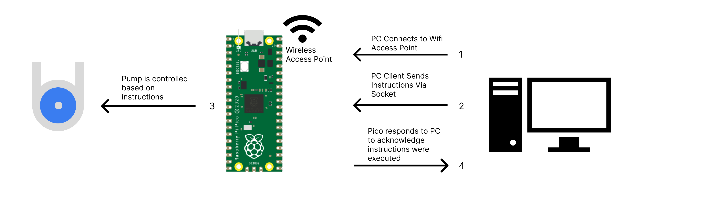
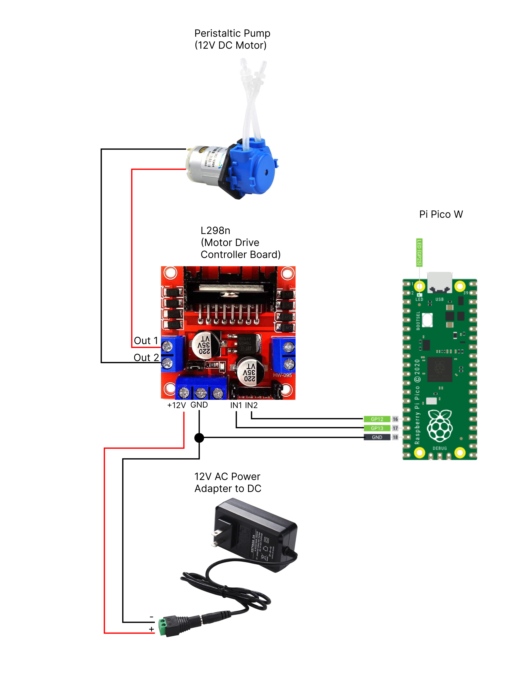

# Initial code for the data driven reef tank project

When using the code, the `motor_server.py` file should be renamed to `main.py` and loaded to your pico w using Thonny  

 
 

The `motor_client.py` file can be ran from your computer after your pico w boots up with `main.py` file (see above) and you have connected to the pico's access point. You'll need to get the IP of your specific pico as well to replace the `host` variable on line 9 in the `motor_client.py` file. This can most easily be done when the pico is connected to your computer using Thonny. (see the getting started instructions https://projects.raspberrypi.org/en/projects/get-started-pico-w/2)

 
 

### Code Overview

### Wiring Diagram

